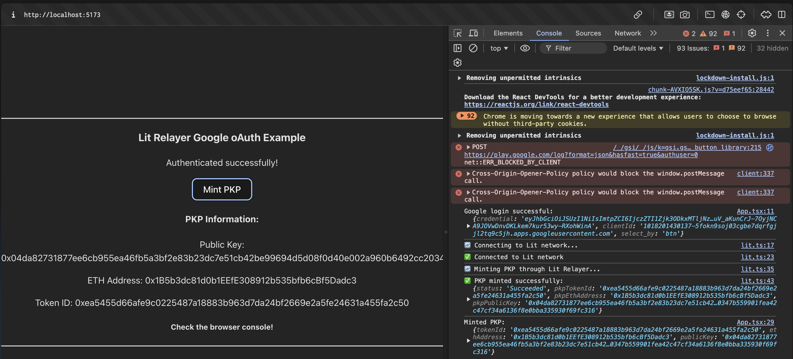

# Mint PKP Through Lit Relayer and Google OAuth

This code examples demonstrates how to mint a PKP through the Lit Relayer, using Google OAuth to authenticate the user.

## Prerequisites

- Google OAuth Client ID and Secret
  - You can get these by creating a new project in the [Google Developer Console](https://console.cloud.google.com/apis/credentials)
- Lit Relayer API Key
  - You submit a request for one using [this form](https://docs.google.com/forms/d/e/1FAIpQLSeVraHsp1evK_9j-8LpUBiEJWFn4G5VKjOWBmHFjxFRJZJdrg/viewform)
- This code example uses Node.js and Yarn

## Installation and Setup

1. Clone the repository
2. `cd` into the code example directory: `cd lit-relayer/mintPKPThroughRelayer/browser`
3. Install the dependencies: `yarn`
4. Create and fill in the `.env` file: `cp .env.example .env`
   - `VITE_GOOGLE_CLIENT_ID`: **Required** This is the Google OAuth Client ID
   - `VITE_GOOGLE_CLIENT_SECRET`: **Required** This is the Google OAuth Client Secret
   - `VITE_LIT_RELAYER_API_KEY`: **Required** This is the Lit Relayer API Key
5. Start the development server: `yarn dev`

## Executing the Example

1. Open the app in your browser: http://localhost:5173
2. Open the JavaScript browser console
3. Click the `Sign in with Google` button and connect your Google account
4. Click the `Mint PKP` button to mint a PKP using the authenticated Google account

### Expected Output

After clicking the `Mint PKP` button, the code example will use the authenticated Google account to mint a PKP through the Lit Relayer.

After successful execution, you should see `✅ PKP successfully minted` in the JavaScript console and the PKP info on the web page:

## Specific Files to Reference

- [App.tsx](./src/App.tsx): Contains the frontend code and the code for authenticating the Google account
- [lit.ts](./src/lit.ts): Contains the code for minting a PKP through the Lit Relayer
