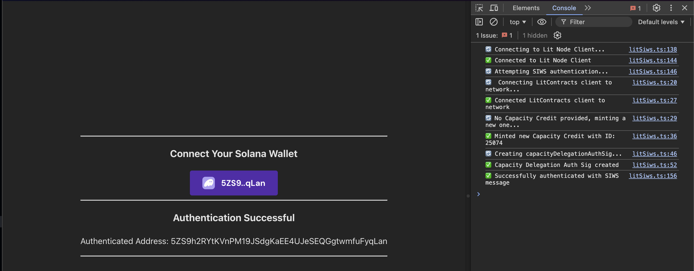

# Sign-in With Solana Access Control Conditions

The code example demonstrates how to create [Lit Access Control Conditions (ACCs)](https://developer.litprotocol.com/sdk/access-control/evm/basic-examples) that only allow access if a specific Solana wallet has signed a Sign-in With Solana (SIWS) message as defined by [Phantom's specification](https://github.com/phantom/sign-in-with-solana/tree/main?tab=readme-ov-file).

This code example has a [corresponding doc page](https://developer.litprotocol.com/sdk/access-control/solana/siws-access-control) that covers the implementation in more detail, this repository acts as a reference implementation for you to use as a guide for implementing SIWS ACCs in your project.

## Prerequisites

- An Ethereum private key
  - This private key will be used to:
    - Mint a Lit Capacity Credit if none was specific in the project's `.env` file
      - In order to pay for this, the corresponding Ethereum account must have Lit Test Tokens. If you do not have any, you can get some from [the faucet](https://chronicle-yellowstone-faucet.getlit.dev/)
    - Create a Lit Capacity Credit delegation Auth Sig
    - Create Lit Session Signatures for the request to the Lit network to execute a Lit Action that authenticates the SIWS message and check for authorization by executing the Access Control Conditions
- This code example uses Node.js and Yarn, please have these installed before running the example
- The code example also expects the [Phantom wallet browser extension](https://chromewebstore.google.com/detail/phantom/bfnaelmomeimhlpmgjnjophhpkkoljpa?hl=en) to be installed and setup with a Solana wallet

## Installation and Setup

1. Clone the repository
2. `cd` into the code example directory: `cd siws-accs/browser`
3. Install the dependencies: `yarn`
4. Create and fill in the `.env` file: `cp .env.example .env`
   - `VITE_ETHEREUM_PRIVATE_KEY`: **Required** This is the Ethereum private key that will be used to mint a Lit Capacity Credit and create Lit Session Signatures
5. Build the Lit Action file: `yarn build:lit-action`
6. Start the development server: `yarn dev`

## Executing the Example

1. Open the app in your browser: http://localhost:5173
2. Open the JavaScript browser console
3. Click the `Select Wallet` button and connect your Phantom wallet
4. Click the `Sign In` button to sign the SIWS message

### Expected Output

After clicking the `Sign In` button, the code example will submit your signed SIWS message to the Lit network to be authenticated using Lit Action and ACCs that only returns true if the SIWS message was signed by your Solana public key.

After successful execution, you should see `✅ Successfully signed SIWS message` in the JavaScript console and `Authentication Successful` on the web page:

## Specific Files to Reference

- [App.tsx](./src/App.tsx): Contains the frontend code and logic for the example
- [SignInButton.tsx](./src/SignInButton.tsx): Contains the code for the `Sign In` button that creates and submits the SIWS message to the browser wallet extension
- [litSiws.ts](./src/litSiws.ts): Contains the code for the generating the ACCs, generating Session Signatures, and executing the Lit Action
- [litActionSiws.ts](./src/litActionSiws.ts): Contains the Lit Action code that authenticates the SIWS message, and executes the ACCs to check for authorization
