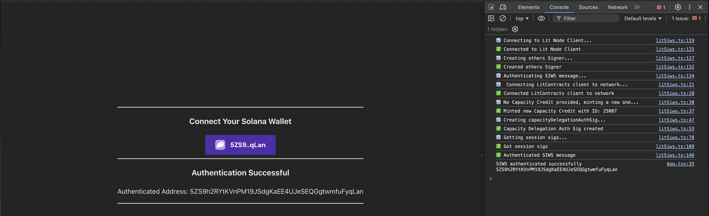

# Sign-in With Solana Authentication

This code example demonstrates how to authenticate a Sign-in With Solana (SIWS) message using a Lit Action and Phantom's [SIWS specification](https://github.com/phantom/sign-in-with-solana/tree/main?tab=readme-ov-file). With this functionality, you can enforce that only specific Solana public keys (aka. addresses) are able to perform certain actions like decrypting data encrypted using Lit, signing transactions using a specific PKP and more.

This code example has a [corresponding doc page](https://developer.litprotocol.com/sdk/authentication/authenticating-siws) that covers the implementation in more detail, this repository acts as a reference implementation for you to use as a guide for authenticating SIWS messages in your project.

## Prerequisites

- An Ethereum private key
  - This private key will be used to:
    - Mint a Lit Capacity Credit if none was specific in the project's `.env` file
      - In order to pay for this, the corresponding Ethereum account must have Lit Test Tokens. If you do not have any, you can get some from [the faucet](https://chronicle-yellowstone-faucet.getlit.dev/)
    - Create a Lit Capacity Credit delegation Auth Sig
- This code example uses Node.js and Yarn, please have these installed before running the example
- The code example also expects the [Phantom wallet browser extension](https://chromewebstore.google.com/detail/phantom/bfnaelmomeimhlpmgjnjophhpkkoljpa?hl=en) to be installed and setup with a Solana wallet

## Installation and Setup

1. Clone the repository
2. `cd` into the code example directory: `cd siws-session-sigs/browser`
3. Install the dependencies: `yarn`
4. Create and fill in the `.env` file: `cp .env.example .env`
   - `VITE_ETHEREUM_PRIVATE_KEY`: **Required** This is the Ethereum private key that will be used to mint a Lit Capacity Credit and create Lit Session Signatures
   - `VITE_LIT_CAPACITY_CREDIT_TOKEN_ID`: **Optional** This is the ID of the Lit Capacity Credit to use for the PKP delegation Auth Sig
   - `VITE_LIT_NETWORK`: **Optional** This is the Lit Network to use for the Lit Contracts and Lit Node Clients
5. Build the Lit Action file: `yarn build:lit-action`
6. Start the development server: `yarn dev`

## Executing the Example

1. Open the app in your browser: http://localhost:5173
2. Open the JavaScript browser console
3. Click the `Select Wallet` button and connect your Phantom wallet
4. Click the `Sign In` button to sign the SIWS message

The following diagram provides an overview of how this code example works:

### Expected Output

After clicking the `Sign In` button, the code example will submit your signed SIWS message to the Lit network to be authenticated using a Lit Action and will return the authenticated Solana public key.

After successful execution, you should see `✅ Authenticated SIWS message` in the JavaScript console and the authenticated Solana public key on the web page:

## Specific Files to Reference

- [App.tsx](./src/App.tsx): Contains the frontend code and logic for the example
- [SignInButton.tsx](./src/SignInButton.tsx): Contains the code for the `Sign In` button that creates and submits the SIWS message to the browser wallet extension
- [litSiws.ts](./src/litSiws.ts): Contains the code for:
  - Minting a Capacity Credit if none was specified in the `.env` file
  - Generating the Capacity Credit delegation Auth Sig
  - Executing the Lit Action to authenticate the SIWS message
- [litActionSiwsAuth.ts](./src/litActionSiwsAuth.ts): Contains the Lit Action code that authenticates the SIWS message
