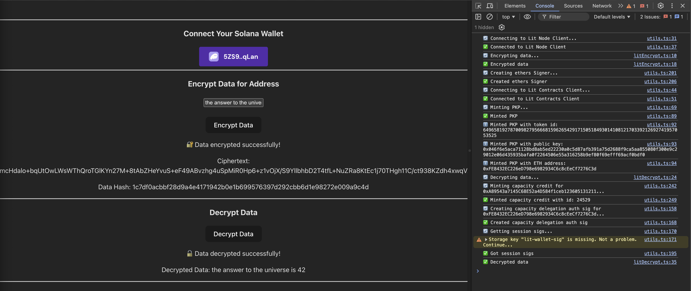

# Encrypting Data with Sign-in With Solana, with custom Lit Action logic and conditions

This example demonstrates how to use Lit Protocol to encrypt and decrypt data based on authenticated Solana public keys, and custom Lit Action logic. The user is authenticated using SIWS, and then the Lit Action can run any additional checks using this authed user. In this example, these custom checks are not implemented, and you should implement them (here)[src/litActions/litActionSessionSigs.ts#L43].

This example leverages two key components:

1. Sign-in With Solana (SIWS) messages (following [Phantom's specification](https://github.com/phantom/sign-in-with-solana/tree/main))
2. Lit Actions

By combining these technologies, we create a secure system for data decryption tied to Solana wallet authentication, with custom Lit Action logic for additional checks.

## Prerequisites

- An Ethereum private key
  - This private key will be used to:
    - Run the Lit Action code. This private key does not require a balance or gas on any chain. However, to run Lit Actions on datil-test, and datil-prod, you do need to pay for each request to the Lit nodes. The easiest way to do this is to use the (Payment Delegation Database Contract system)[https://developer.litprotocol.com/paying-for-lit/payment-delegation-db] and add this wallet as a "Payee". In this case, the wallet will not need any Lit Test Tokens. Instead, the Lit Nodes will check if this wallet has a corresponding "Payer" that has enough Lit Test Tokens, and deduct payment from the Payer's balance.
- This code example uses Node.js, Yarn, and Deno please have these installed before running the example
- The code example also expects the [Phantom wallet browser extension](https://chromewebstore.google.com/detail/phantom/bfnaelmomeimhlpmgjnjophhpkkoljpa?hl=en) to be installed and setup with a Solana wallet

## Installation and Setup

1. Clone the repository
2. `cd` into the code example directory: `cd siws-session-sigs/browser`
3. Install the dependencies: `yarn`
4. Create and fill in the `.env` file: `cp .env.example .env`
   - `VITE_ETHEREUM_PRIVATE_KEY`: **Required** This is the Ethereum private key that will be used to run the Lit Action code. This private key will be exposed on the frontend, so it should not be a private key for a wallet with any real funds.
5. Build the Lit Action file: `yarn build:lit-action`
6. Start the development server: `yarn dev`

[!IMPORTANT]
The Lit Action code is compiled into the browser bundle, so you will need to rebuild the Lit Action code whenever you make changes to it. Run `yarn build:lit-action` to rebuild the Lit Action code any time you change the code in the `src/litActions/litActionDecrypt.ts` file.

## Executing the Example

1. Open the app in your browser: http://localhost:5173
2. Open the JavaScript browser console
3. Click the `Select Wallet` button and connect your Phantom wallet
4. Click the `Sign In` button to sign the SIWS message
5. Enter some text in the encryption input field and click the `Encrypt` button
6. Click the `Decrypt` button to decrypt the data

The following diagram provides an overview of how this code example works:

### Expected Output

After clicking the `Sign In` button, the code example will submit your signed SIWS message to the Lit network to be authenticated using a Lit Action and will generate Session Signatures using the minted PKP if the signing Solana public key is authorized to use the PKP.

After successful execution, you should see `✅ Got Session sigs` in the JavaScript console and `Session Sigs generated successfully` on the web page:

## Specific Files to Reference

- [App.tsx](./src/App.tsx): Contains the frontend code and logic for the example
- [SignInButton.tsx](./src/SignInButton.tsx): Contains the code for the `Sign In` button that creates and submits the SIWS message to the browser wallet extension
- [litSiws.ts](./src/litSiws.ts): Contains the code for:
  - Minting a Capacity Credit if none was specified in the `.env` file
  - Generating the Capacity Credit delegation Auth Sig
  - Minting a PKP if none was specified in the `.env` file
  - Adding the permitted Auth Methods to the PKP
  - Executing the Lit Action to authenticate the SIWS message and generate Session Signatures
- [litActionSessionSigs.ts](./src/litActionSessionSigs.ts): Contains the Lit Action code that authenticates the SIWS message, checks the PKPs permitted Auth Methods, and signals the Lit Network to generate Session Signatures
