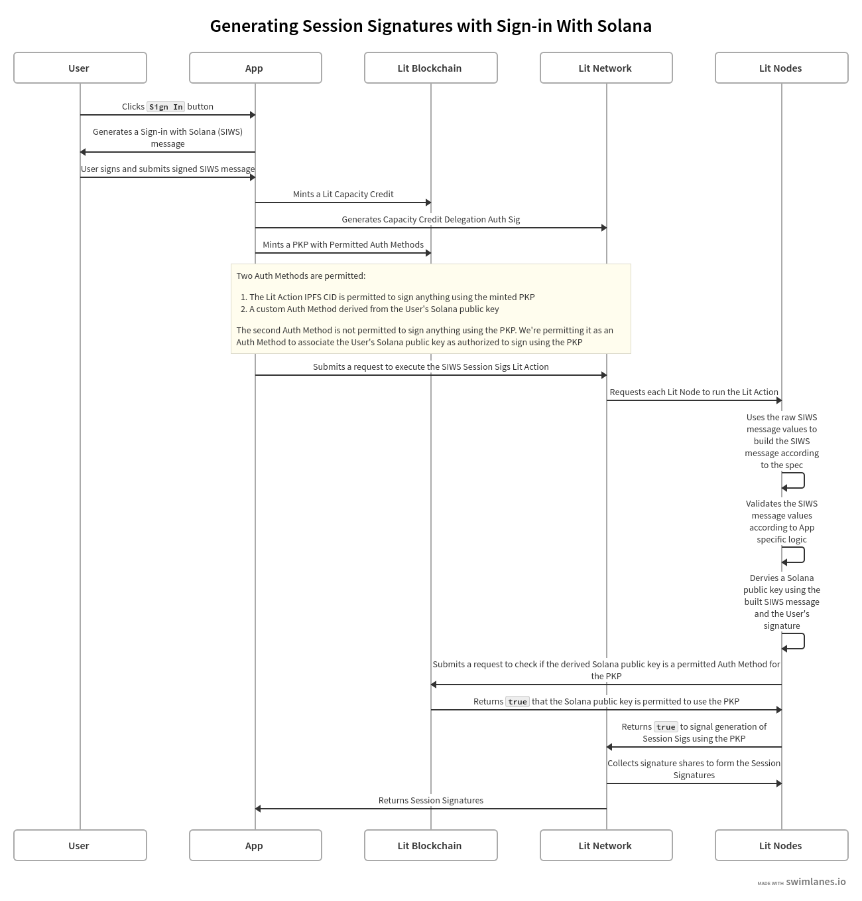
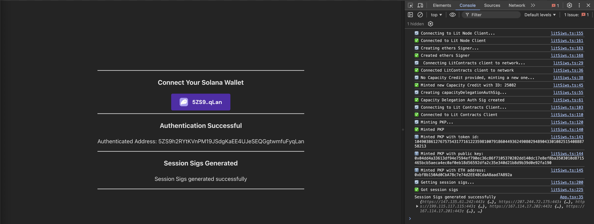

# Sign-in With Solana Session Signatures

The code example demonstrates how to create [Lit Session Signatures](https://developer.litprotocol.com/sdk/authentication/session-sigs/intro) using a [Programmable Key Pair (PKP)](https://developer.litprotocol.com/user-wallets/pkps/overview) that will only sign if a specific Solana public key is authenticated using a signed Sign-in With Solana (SIWS) message as defined by [Phantom's specification](https://github.com/phantom/sign-in-with-solana/tree/main?tab=readme-ov-file).

This code example has a [corresponding doc page](https://developer.litprotocol.com/sdk/access-control/solana/siws-session-sigs) that covers the implementation in more detail, this repository acts as a reference implementation for you to use as a guide for generating Session Signatures using SIWS in your project.

## Prerequisites

- An Ethereum private key
  - This private key will be used to:
    - Mint a Lit Capacity Credit if none was specific in the project's `.env` file
      - In order to pay for this, the corresponding Ethereum account must have Lit Test Tokens. If you do not have any, you can get some from [the faucet](https://chronicle-yellowstone-faucet.getlit.dev/)
    - Create a Lit Capacity Credit delegation Auth Sig
    - Mint a PKP if none was specific in the project's `.env` file
- This code example uses Node.js and Yarn, please have these installed before running the example
- The code example also expects the [Phantom wallet browser extension](https://chromewebstore.google.com/detail/phantom/bfnaelmomeimhlpmgjnjophhpkkoljpa?hl=en) to be installed and setup with a Solana wallet

## Installation and Setup

1. Clone the repository
2. `cd` into the code example directory: `cd siws-session-sigs/browser`
3. Install the dependencies: `yarn`
4. Create and fill in the `.env` file: `cp .env.example .env`
   - `VITE_ETHEREUM_PRIVATE_KEY`: **Required** This is the Ethereum private key that will be used to mint a Lit Capacity Credit and create Lit Session Signatures
   - `VITE_LIT_CAPACITY_CREDIT_TOKEN_ID`: **Optional** This is the ID of the Lit Capacity Credit to use for the PKP delegation Auth Sig
   - `VITE_LIT_PKP_PUBLIC_KEY`: **Optional** This is the public key of the PKP to use for generating Session Signatures
   - `VITE_LIT_PKP_TOKEN_ID`: **Optional** This is the ID of the PKP to use for generating Session Signatures
5. Build the Lit Action file: `yarn build:lit-action`
6. Start the development server: `yarn dev`

## Executing the Example

1. Open the app in your browser: http://localhost:5173
2. Open the JavaScript browser console
3. Click the `Select Wallet` button and connect your Phantom wallet
4. Click the `Sign In` button to sign the SIWS message

The following diagram provides an overview of how this code example works:

### Expected Output

After clicking the `Sign In` button, the code example will submit your signed SIWS message to the Lit network to be authenticated using a Lit Action and will generate Session Signatures using the minted PKP if the signing Solana public key is authorized to use the PKP.

After successful execution, you should see `✅ Got Session sigs` in the JavaScript console and `Session Sigs generated successfully` on the web page:

## Specific Files to Reference

- [App.tsx](./src/App.tsx): Contains the frontend code and logic for the example
- [SignInButton.tsx](./src/SignInButton.tsx): Contains the code for the `Sign In` button that creates and submits the SIWS message to the browser wallet extension
- [litSiws.ts](./src/litSiws.ts): Contains the code for:
  - Minting a Capacity Credit if none was specified in the `.env` file
  - Generating the Capacity Credit delegation Auth Sig
  - Minting a PKP if none was specified in the `.env` file
  - Adding the permitted Auth Methods to the PKP
  - Executing the Lit Action to authenticate the SIWS message and generate Session Signatures
- [litActionSessionSigs.ts](./src/litActionSessionSigs.ts): Contains the Lit Action code that authenticates the SIWS message, checks the PKPs permitted Auth Methods, and signals the Lit Network to generate Session Signatures
